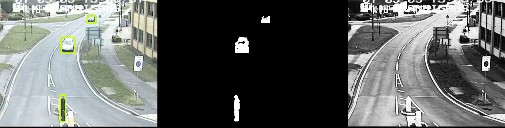
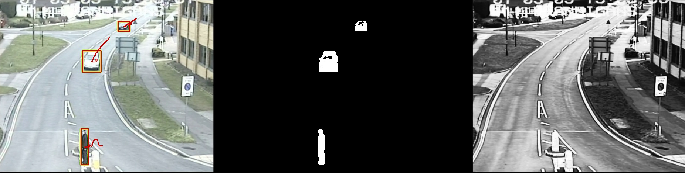

#  Multiple objects detection and tracking  in C++ and using Opencv libraries  
[Simple tutorial]

## Objects detection using RGB video
### Background Modeling technique
Selective background modeling technique
### Moving objects detection

## Object tracking
Data association 

Moving objects tracking
https://user-images.githubusercontent.com/19721447/191731611-a85db9f8-3f68-48a6-ac48-f9a2190d73a5.mov

